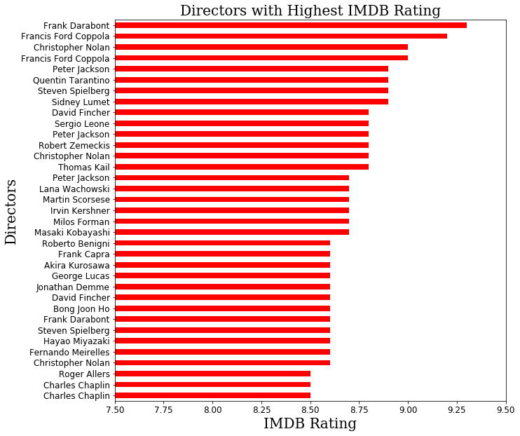
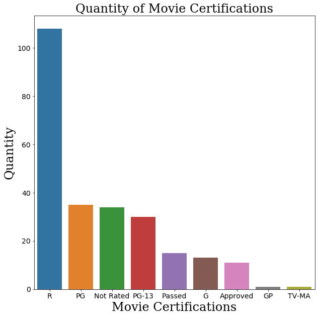
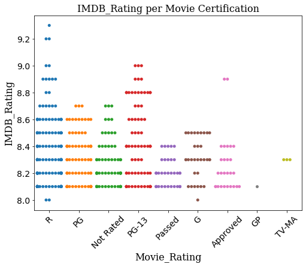
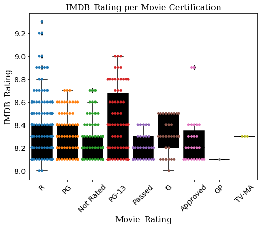
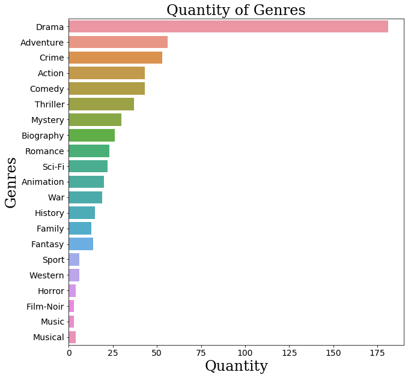
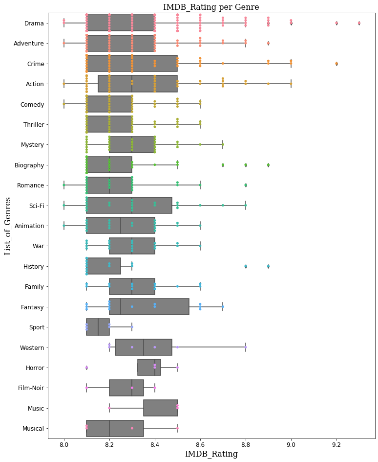

## Final Project Submission

Please fill out:
* Student name: Hiten Patel  
* Student pace: Full Time Online Data Science
* Scheduled project review date/time: Aug, 7th; 1;30pm
* Instructor name: James Irving 
* Blog post URL:https://hpatel530.github.io/


```python
# Your code here - remember to use markdown cells for comments as well!
```

## **Introduction**
Microsoft has decided to create a new movie studio and they are looking for a team to help them better understand the movie industry. The team will be in charged with doing data analysis and creating a presentation that explores what type of films are currently doing the best at the box office.

The database that was chosen was the IMDB's Top 250 Films. The ratings are calculated by using a combination of fans and critics. The decision was based on using a database that only consisted of highly rated films and not a database that consist of every film in the market, which could produce outliers and misleading numbers. 

I took on 'what the fans love' approach and did not pay much attention to the box office numbers.

For example look at the data for the following movies; 

Alice in Wonderland (2010) IMDB Rating: 6.4/10 World-wide Gross: 1  Billion 

Transformers: Age of Extinction (2014) IMDB Rating: 5.6/10 
World-wide Gross: 1.1 Billion

The Godfather (1972) IMDB Rating: 9.2/10 
World-wide Gross: 246 Million

The Shawshank Redemption (1994)	IMDB Rating: 9.3/10	
World-wide Gross: Less than 29 million

Movies that made a splash at the box office had low user/fan ratings. On the contrary, movies with high ratings didn't do so well at the box-office. Actually, they stunk.

Why is that? Better marketing? More movie-watchers this generation? How would a film like The Godfather or The Shawshank Redemption do in this generation? We may never know. But, what we do know, is the fans love these types of films and I will present to you why. 

## WEB Scraping IMDB TOP 250 

**Using the get() method to retrieve a website**

**Using the status_code method to double check success**


```python
import requests
url = 'https://www.imdb.com/search/title/?groups=top_250&sort=user_rating'
response = requests.get(url)
response.status_code
```


    200


**Importing BeautifulSoup and running the website through that package**


```python
from bs4 import BeautifulSoup 
soup = BeautifulSoup(response.content, 'html.parser')
```

**Extracting the Movie Title from Page 1**


```python
title_content = soup.find('div', class_='lister-list')
list_of_h3= title_content.find_all('h3')

final_title = []
for h3 in list_of_h3: 
    text = h3.text.replace('\n', '').split('.')[1]
    text = text[:-6]
    final_title.append(text) 
print (final_title)
```

    ['The Shawshank Redemption', 'The Godfather', 'The Dark Knight', 'The Godfather: Part II', 'The Lord of the Rings: The Return of the King', 'Pulp Fiction', "Schindler's List", '12 Angry Men', 'Hamilton', 'Inception', 'Fight Club', 'The Lord of the Rings: The Fellowship of the Ring', 'Forrest Gump', 'The Good, the Bad and the Ugly', 'The Lord of the Rings: The Two Towers', 'The Matrix', 'Goodfellas', 'Star Wars: Episode V - The Empire Strikes Back', "One Flew Over the Cuckoo's Nest", 'Harakiri', 'Parasite', 'Interstellar', 'City of God', 'Spirited Away', 'Saving Private Ryan', 'The Green Mile', 'Life Is Beautiful', 'Se7en', 'The Silence of the Lambs', 'Star Wars: Episode IV - A New Hope', 'Seven Samurai', "It's a Wonderful Life", 'Joker', 'Whiplash', 'The Intouchables', 'The Prestige', 'The Departed', 'The Pianist', 'Gladiator', 'American History X', 'The Usual Suspects', 'Léon: The Professional', 'The Lion King', 'Terminator 2: Judgment Day', 'Cinema Paradiso', 'Grave of the Fireflies', 'Back to the Future', 'Anand', 'Once Upon a Time in the West', 'Psycho']


**Retrieve Movie Title Function**


```python
def retrieve_movietitle(soup):
    """Retrieving movie titles from soup"""
    title_content = soup.find('div', class_='lister-list')
    list_of_h3= title_content.find_all('h3')
    
    final_title = []
    for h3 in list_of_h3: 
        text = h3.text.replace('\n', '').split('.')[1]
        text = text[:-6]
        final_title.append(text)
    
    return final_title
```


```python
#testing the function 
retrieve_movietitle(soup)
```


    ['The Shawshank Redemption',
     'The Godfather',
     'The Dark Knight',
     'The Godfather: Part II',
     'The Lord of the Rings: The Return of the King',
     'Pulp Fiction',
     "Schindler's List",
     '12 Angry Men',
     'Hamilton',
     'Inception',
     'Fight Club',
     'The Lord of the Rings: The Fellowship of the Ring',
     'Forrest Gump',
     'The Good, the Bad and the Ugly',
     'The Lord of the Rings: The Two Towers',
     'The Matrix',
     'Goodfellas',
     'Star Wars: Episode V - The Empire Strikes Back',
     "One Flew Over the Cuckoo's Nest",
     'Harakiri',
     'Parasite',
     'Interstellar',
     'City of God',
     'Spirited Away',
     'Saving Private Ryan',
     'The Green Mile',
     'Life Is Beautiful',
     'Se7en',
     'The Silence of the Lambs',
     'Star Wars: Episode IV - A New Hope',
     'Seven Samurai',
     "It's a Wonderful Life",
     'Joker',
     'Whiplash',
     'The Intouchables',
     'The Prestige',
     'The Departed',
     'The Pianist',
     'Gladiator',
     'American History X',
     'The Usual Suspects',
     'Léon: The Professional',
     'The Lion King',
     'Terminator 2: Judgment Day',
     'Cinema Paradiso',
     'Grave of the Fireflies',
     'Back to the Future',
     'Anand',
     'Once Upon a Time in the West',
     'Psycho']


**Extracting the Release Year**


```python
title_content = soup.find('div', class_='lister-list')
list_of_h3= title_content.find_all('h3')
#list_of_h3[0].text.replace('\n', '')[-5:-1]

release_year = []
for h3 in list_of_h3:
    text = h3.text[-6:-2]
    release_year.append(text)
print(release_year)
```

    ['1994', '1972', '2008', '1974', '2003', '1994', '1993', '1957', '2020', '2010', '1999', '2001', '1994', '1966', '2002', '1999', '1990', '1980', '1975', '1962', '2019', '2014', '2002', '2001', '1998', '1999', '1997', '1995', '1991', '1977', '1954', '1946', '2019', '2014', '2011', '2006', '2006', '2002', '2000', '1998', '1995', '1994', '1994', '1991', '1988', '1988', '1985', '1971', '1968', '1960']


**Retrieve Release Year Function**


```python
def retrieve_year(soup): 
    """Retrieving the release year of the movie from soup"""
    title_content = soup.find('div', class_='lister-list')
    list_of_h3= title_content.find_all('h3')
    
    release_year = []
    for h3 in list_of_h3:
        text = h3.text[-6:-2]
        release_year.append(text)
    return release_year
```


```python
#testing the function 
retrieve_year(soup)
```


    ['1994',
     '1972',
     '2008',
     '1974',
     '2003',
     '1994',
     '1993',
     '1957',
     '2020',
     '2010',
     '1999',
     '2001',
     '1994',
     '1966',
     '2002',
     '1999',
     '1990',
     '1980',
     '1975',
     '1962',
     '2019',
     '2014',
     '2002',
     '2001',
     '1998',
     '1999',
     '1997',
     '1995',
     '1991',
     '1977',
     '1954',
     '1946',
     '2019',
     '2014',
     '2011',
     '2006',
     '2006',
     '2002',
     '2000',
     '1998',
     '1995',
     '1994',
     '1994',
     '1991',
     '1988',
     '1988',
     '1985',
     '1971',
     '1968',
     '1960']


**Extracting the Movie Genre**


```python
title_content = soup.find('div', class_='lister-list')
genre = title_content.find_all('span', class_= 'genre')
#genre[0].text.strip()

final_genre = []
for g in genre:
    words = g.text.strip()
    final_genre.append(words)
print(len(final_genre), final_genre)
```

    50 ['Drama', 'Crime, Drama', 'Action, Crime, Drama', 'Crime, Drama', 'Action, Adventure, Drama', 'Crime, Drama', 'Biography, Drama, History', 'Crime, Drama', 'Biography, Drama, History', 'Action, Adventure, Sci-Fi', 'Drama', 'Action, Adventure, Drama', 'Drama, Romance', 'Western', 'Action, Adventure, Drama', 'Action, Sci-Fi', 'Biography, Crime, Drama', 'Action, Adventure, Fantasy', 'Drama', 'Action, Drama, Mystery', 'Comedy, Drama, Thriller', 'Adventure, Drama, Sci-Fi', 'Crime, Drama', 'Animation, Adventure, Family', 'Drama, War', 'Crime, Drama, Fantasy', 'Comedy, Drama, Romance', 'Crime, Drama, Mystery', 'Crime, Drama, Thriller', 'Action, Adventure, Fantasy', 'Action, Adventure, Drama', 'Drama, Family, Fantasy', 'Crime, Drama, Thriller', 'Drama, Music', 'Biography, Comedy, Drama', 'Drama, Mystery, Sci-Fi', 'Crime, Drama, Thriller', 'Biography, Drama, Music', 'Action, Adventure, Drama', 'Drama', 'Crime, Mystery, Thriller', 'Action, Crime, Drama', 'Animation, Adventure, Drama', 'Action, Sci-Fi', 'Drama', 'Animation, Drama, War', 'Adventure, Comedy, Sci-Fi', 'Drama, Musical', 'Western', 'Horror, Mystery, Thriller']


**Retrieve Genre Function**


```python
def retrieve_genre(soup):
    """Retrieving the genre of the movie from soup"""
    title_content = soup.find('div', class_='lister-list')
    genre = title_content.find_all('span', class_= 'genre')

    final_genre = []
    for g in genre:
        words = g.text.strip()
        final_genre.append(words)
    return final_genre
```


```python
#testing the function 
retrieve_genre(soup)
```


    ['Drama',
     'Crime, Drama',
     'Action, Crime, Drama',
     'Crime, Drama',
     'Action, Adventure, Drama',
     'Crime, Drama',
     'Biography, Drama, History',
     'Crime, Drama',
     'Biography, Drama, History',
     'Action, Adventure, Sci-Fi',
     'Drama',
     'Action, Adventure, Drama',
     'Drama, Romance',
     'Western',
     'Action, Adventure, Drama',
     'Action, Sci-Fi',
     'Biography, Crime, Drama',
     'Action, Adventure, Fantasy',
     'Drama',
     'Action, Drama, Mystery',
     'Comedy, Drama, Thriller',
     'Adventure, Drama, Sci-Fi',
     'Crime, Drama',
     'Animation, Adventure, Family',
     'Drama, War',
     'Crime, Drama, Fantasy',
     'Comedy, Drama, Romance',
     'Crime, Drama, Mystery',
     'Crime, Drama, Thriller',
     'Action, Adventure, Fantasy',
     'Action, Adventure, Drama',
     'Drama, Family, Fantasy',
     'Crime, Drama, Thriller',
     'Drama, Music',
     'Biography, Comedy, Drama',
     'Drama, Mystery, Sci-Fi',
     'Crime, Drama, Thriller',
     'Biography, Drama, Music',
     'Action, Adventure, Drama',
     'Drama',
     'Crime, Mystery, Thriller',
     'Action, Crime, Drama',
     'Animation, Adventure, Drama',
     'Action, Sci-Fi',
     'Drama',
     'Animation, Drama, War',
     'Adventure, Comedy, Sci-Fi',
     'Drama, Musical',
     'Western',
     'Horror, Mystery, Thriller']


**Extracting the Movie Certification(ex: R, PG-13)**


```python
title_content = soup.find('div', class_='lister-list')
rating = title_content.find_all('span', class_= 'certificate')

certification = []
for p in rating:
    new_rating = p.text
    certification.append(new_rating)
    
print (len(certification), certification)
```

    50 ['R', 'R', 'PG-13', 'R', 'PG-13', 'R', 'R', 'Approved', 'PG-13', 'PG-13', 'R', 'PG-13', 'PG-13', 'R', 'PG-13', 'R', 'R', 'PG', 'R', 'Not Rated', 'R', 'PG-13', 'R', 'PG', 'R', 'R', 'PG-13', 'R', 'R', 'PG', 'Not Rated', 'PG', 'R', 'R', 'R', 'PG-13', 'R', 'R', 'R', 'R', 'R', 'R', 'G', 'R', 'R', 'Not Rated', 'PG', 'Not Rated', 'PG-13', 'R']


**Retrieve Movie Certification Function**


```python
def retrieve_cert(soup):
    """Retrieving the certification of the movie from soup"""
    title_content = soup.find('div', class_='lister-list')
    rating = title_content.find_all('span', class_= 'certificate')
    
    certification = []
    for p in rating:
        new_rating = p.text
        certification.append(new_rating)
    
    return certification
```


```python
#testing the function 
retrieve_cert(soup)
```


    ['R',
     'R',
     'PG-13',
     'R',
     'PG-13',
     'R',
     'R',
     'Approved',
     'PG-13',
     'PG-13',
     'R',
     'PG-13',
     'PG-13',
     'R',
     'PG-13',
     'R',
     'R',
     'PG',
     'R',
     'Not Rated',
     'R',
     'PG-13',
     'R',
     'PG',
     'R',
     'R',
     'PG-13',
     'R',
     'R',
     'PG',
     'Not Rated',
     'PG',
     'R',
     'R',
     'R',
     'PG-13',
     'R',
     'R',
     'R',
     'R',
     'R',
     'R',
     'G',
     'R',
     'R',
     'Not Rated',
     'PG',
     'Not Rated',
     'PG-13',
     'R']


**Extracting the Movie IMDB Rating**


```python
title_content = soup.find('div', class_='lister-list')
imdb = title_content.find_all('div', class_='inline-block ratings-imdb-rating')
#imdb[0].text.replace('\n', "")

imdb_rating = []
for rate in imdb:
    rating = rate.text.strip()
    imdb_rating.append(rating)
print (len(imdb_rating), imdb_rating)
```

    50 ['9.3', '9.2', '9.0', '9.0', '8.9', '8.9', '8.9', '8.9', '8.8', '8.8', '8.8', '8.8', '8.8', '8.8', '8.7', '8.7', '8.7', '8.7', '8.7', '8.7', '8.6', '8.6', '8.6', '8.6', '8.6', '8.6', '8.6', '8.6', '8.6', '8.6', '8.6', '8.6', '8.5', '8.5', '8.5', '8.5', '8.5', '8.5', '8.5', '8.5', '8.5', '8.5', '8.5', '8.5', '8.5', '8.5', '8.5', '8.5', '8.5', '8.5']


**Retrieve Movie IMDB Rating Function**


```python
def retrieve_imdb(soup):
    """Retrieving the movie imdb rating from soup"""
    title_content = soup.find('div', class_='lister-list')
    imdb = title_content.find_all('div', class_='inline-block ratings-imdb-rating')
    
    imdb_rating = []
    for rate in imdb:
        rating = rate.text.strip()
        imdb_rating.append(rating)
    return imdb_rating
```


```python
#testing the function 
retrieve_imdb(soup)
```


    ['9.3',
     '9.2',
     '9.0',
     '9.0',
     '8.9',
     '8.9',
     '8.9',
     '8.9',
     '8.8',
     '8.8',
     '8.8',
     '8.8',
     '8.8',
     '8.8',
     '8.7',
     '8.7',
     '8.7',
     '8.7',
     '8.7',
     '8.7',
     '8.6',
     '8.6',
     '8.6',
     '8.6',
     '8.6',
     '8.6',
     '8.6',
     '8.6',
     '8.6',
     '8.6',
     '8.6',
     '8.6',
     '8.5',
     '8.5',
     '8.5',
     '8.5',
     '8.5',
     '8.5',
     '8.5',
     '8.5',
     '8.5',
     '8.5',
     '8.5',
     '8.5',
     '8.5',
     '8.5',
     '8.5',
     '8.5',
     '8.5',
     '8.5']


**Extracting the Director**


```python
title_content = soup.find('div', class_='lister-list')
director = title_content.find_all('p', class_="")
#director[0].find('a').text

final_directors = []
for person in director:
    final = person.find('a').text
    final_directors.append(final)
print(final_directors)
```

    ['Frank Darabont', 'Francis Ford Coppola', 'Christopher Nolan', 'Francis Ford Coppola', 'Peter Jackson', 'Quentin Tarantino', 'Steven Spielberg', 'Sidney Lumet', 'Thomas Kail', 'Christopher Nolan', 'David Fincher', 'Peter Jackson', 'Robert Zemeckis', 'Sergio Leone', 'Peter Jackson', 'Lana Wachowski', 'Martin Scorsese', 'Irvin Kershner', 'Milos Forman', 'Masaki Kobayashi', 'Bong Joon Ho', 'Christopher Nolan', 'Fernando Meirelles', 'Hayao Miyazaki', 'Steven Spielberg', 'Frank Darabont', 'Roberto Benigni', 'David Fincher', 'Jonathan Demme', 'George Lucas', 'Akira Kurosawa', 'Frank Capra', 'Todd Phillips', 'Damien Chazelle', 'Olivier Nakache', 'Christopher Nolan', 'Martin Scorsese', 'Roman Polanski', 'Ridley Scott', 'Tony Kaye', 'Bryan Singer', 'Luc Besson', 'Roger Allers', 'James Cameron', 'Giuseppe Tornatore', 'Isao Takahata', 'Robert Zemeckis', 'Hrishikesh Mukherjee', 'Sergio Leone', 'Alfred Hitchcock']


**Retrieve Movie Director Function**


```python
def retrieve_director(soup):
    '''Retrieving movie director from soup'''
    title_content = soup.find('div', class_='lister-list')
    director = title_content.find_all('p', class_="")

    final_directors = []
    for person in director:
        final = person.find('a').text
        final_directors.append(final)
    return final_directors
```


```python
#testing the function 
retrieve_director(soup)
```


    ['Frank Darabont',
     'Francis Ford Coppola',
     'Christopher Nolan',
     'Francis Ford Coppola',
     'Peter Jackson',
     'Quentin Tarantino',
     'Steven Spielberg',
     'Sidney Lumet',
     'Thomas Kail',
     'Christopher Nolan',
     'David Fincher',
     'Peter Jackson',
     'Robert Zemeckis',
     'Sergio Leone',
     'Peter Jackson',
     'Lana Wachowski',
     'Martin Scorsese',
     'Irvin Kershner',
     'Milos Forman',
     'Masaki Kobayashi',
     'Bong Joon Ho',
     'Christopher Nolan',
     'Fernando Meirelles',
     'Hayao Miyazaki',
     'Steven Spielberg',
     'Frank Darabont',
     'Roberto Benigni',
     'David Fincher',
     'Jonathan Demme',
     'George Lucas',
     'Akira Kurosawa',
     'Frank Capra',
     'Todd Phillips',
     'Damien Chazelle',
     'Olivier Nakache',
     'Christopher Nolan',
     'Martin Scorsese',
     'Roman Polanski',
     'Ridley Scott',
     'Tony Kaye',
     'Bryan Singer',
     'Luc Besson',
     'Roger Allers',
     'James Cameron',
     'Giuseppe Tornatore',
     'Isao Takahata',
     'Robert Zemeckis',
     'Hrishikesh Mukherjee',
     'Sergio Leone',
     'Alfred Hitchcock']


**Extracting the Domestic Gross in Millions**


```python
title_content = soup.find('div', class_='lister-list')
gross = title_content.find_all('p', class_='sort-num_votes-visible')

final_gross = []
for money in gross: 
    final = money.find_all('span')
    final = final[-1].text
    final_gross.append(final)
print(final_gross)
```

    ['$28.34M', '$134.97M', '$534.86M', '$57.30M', '$377.85M', '$107.93M', '$96.90M', '$4.36M', '32,728', '$292.58M', '$37.03M', '$315.54M', '$330.25M', '$6.10M', '$342.55M', '$171.48M', '$46.84M', '$290.48M', '$112.00M', '36,628', '$53.37M', '$188.02M', '$7.56M', '$10.06M', '$216.54M', '$136.80M', '$57.60M', '$100.13M', '$130.74M', '$322.74M', '$0.27M', '387,088', '$335.45M', '$13.09M', '$13.18M', '$53.09M', '$132.38M', '$32.57M', '$187.71M', '$6.72M', '$23.34M', '$19.50M', '$422.78M', '$204.84M', '$11.99M', '223,985', '$210.61M', '27,723', '$5.32M', '$32.00M']


**Retrieve Domestic Gross Function**


```python

def retrieve_domestic(soup):
    """Retriving domestic gross from soup"""
    title_content = soup.find('div', class_='lister-list')
    gross = title_content.find_all('p', class_='sort-num_votes-visible')

    final_gross = []
    for money in gross: 
        final = money.find_all('span')
        final = final[-1].text
        final_gross.append(final)
    return final_gross
```


```python
#testing the function 
retrieve_domestic(soup)
```


    ['$28.34M',
     '$134.97M',
     '$534.86M',
     '$57.30M',
     '$377.85M',
     '$107.93M',
     '$96.90M',
     '$4.36M',
     '32,728',
     '$292.58M',
     '$37.03M',
     '$315.54M',
     '$330.25M',
     '$6.10M',
     '$342.55M',
     '$171.48M',
     '$46.84M',
     '$290.48M',
     '$112.00M',
     '36,628',
     '$53.37M',
     '$188.02M',
     '$7.56M',
     '$10.06M',
     '$216.54M',
     '$136.80M',
     '$57.60M',
     '$100.13M',
     '$130.74M',
     '$322.74M',
     '$0.27M',
     '387,088',
     '$335.45M',
     '$13.09M',
     '$13.18M',
     '$53.09M',
     '$132.38M',
     '$32.57M',
     '$187.71M',
     '$6.72M',
     '$23.34M',
     '$19.50M',
     '$422.78M',
     '$204.84M',
     '$11.99M',
     '223,985',
     '$210.61M',
     '27,723',
     '$5.32M',
     '$32.00M']


## Creating a code to retrieve all the data from all the movies listed from all the pages


```python
#importing the neccessary packages to complete the process
import pandas as pd
import requests
from bs4 import BeautifulSoup
```


```python
#created a list for each category and created a for loop to iterate through and retrieve the information from the web
movie_titles = []
year_released = []
genres = []
certification = []
imdb_rating = []
director = []
dom_gross = []
url = ["https://www.imdb.com/search/title/?groups=top_250&sort=user_rating", 
                'https://www.imdb.com/search/title/?groups=top_250&sort=user_rating,desc&start=51&ref_=adv_nxt',
                'https://www.imdb.com/search/title/?groups=top_250&sort=user_rating,desc&start=101&ref_=adv_nxt',
                'https://www.imdb.com/search/title/?groups=top_250&sort=user_rating,desc&start=151&ref_=adv_nxt',
                'https://www.imdb.com/search/title/?groups=top_250&sort=user_rating,desc&start=201&ref_=adv_nxt',]

for i in url:      

    response = requests.get(i)
    soup = BeautifulSoup(response.content, 'html.parser')
    movie_titles += retrieve_movietitle(soup)
    year_released += retrieve_year(soup)
    genres += retrieve_genre(soup)
    certification += retrieve_cert(soup)
    imdb_rating += retrieve_imdb(soup)
    director += retrieve_director(soup)
    dom_gross += retrieve_domestic(soup)
        
df = pd.DataFrame([movie_titles, year_released, genres, certification, imdb_rating, director, dom_gross]).transpose()
df.columns = ['Title', 'Year_Released', 'Genres', 'Movie_Rating', 'IMDB_Rating', 'Director', 'Domestic_Gross(millions)']
print (len(df))
display (df.head())
df.tail()
```

    250


<div>
<style scoped>
    .dataframe tbody tr th:only-of-type {
        vertical-align: middle;
    }

    .dataframe tbody tr th {
        vertical-align: top;
    }

    .dataframe thead th {
        text-align: right;
    }
</style>
<table border="1" class="dataframe">
  <thead>
    <tr style="text-align: right;">
      <th></th>
      <th>Title</th>
      <th>Year_Released</th>
      <th>Genres</th>
      <th>Movie_Rating</th>
      <th>IMDB_Rating</th>
      <th>Director</th>
      <th>Domestic_Gross(millions)</th>
    </tr>
  </thead>
  <tbody>
    <tr>
      <th>0</th>
      <td>The Shawshank Redemption</td>
      <td>1994</td>
      <td>Drama</td>
      <td>R</td>
      <td>9.3</td>
      <td>Frank Darabont</td>
      <td>$28.34M</td>
    </tr>
    <tr>
      <th>1</th>
      <td>The Godfather</td>
      <td>1972</td>
      <td>Crime, Drama</td>
      <td>R</td>
      <td>9.2</td>
      <td>Francis Ford Coppola</td>
      <td>$134.97M</td>
    </tr>
    <tr>
      <th>2</th>
      <td>The Dark Knight</td>
      <td>2008</td>
      <td>Action, Crime, Drama</td>
      <td>PG-13</td>
      <td>9.0</td>
      <td>Christopher Nolan</td>
      <td>$534.86M</td>
    </tr>
    <tr>
      <th>3</th>
      <td>The Godfather: Part II</td>
      <td>1974</td>
      <td>Crime, Drama</td>
      <td>R</td>
      <td>9.0</td>
      <td>Francis Ford Coppola</td>
      <td>$57.30M</td>
    </tr>
    <tr>
      <th>4</th>
      <td>The Lord of the Rings: The Return of the King</td>
      <td>2003</td>
      <td>Action, Adventure, Drama</td>
      <td>PG-13</td>
      <td>8.9</td>
      <td>Peter Jackson</td>
      <td>$377.85M</td>
    </tr>
  </tbody>
</table>
</div>


<div>
<style scoped>
    .dataframe tbody tr th:only-of-type {
        vertical-align: middle;
    }

    .dataframe tbody tr th {
        vertical-align: top;
    }

    .dataframe thead th {
        text-align: right;
    }
</style>
<table border="1" class="dataframe">
  <thead>
    <tr style="text-align: right;">
      <th></th>
      <th>Title</th>
      <th>Year_Released</th>
      <th>Genres</th>
      <th>Movie_Rating</th>
      <th>IMDB_Rating</th>
      <th>Director</th>
      <th>Domestic_Gross(millions)</th>
    </tr>
  </thead>
  <tbody>
    <tr>
      <th>245</th>
      <td>The General</td>
      <td>1926</td>
      <td>Action, Adventure, Comedy</td>
      <td>R</td>
      <td>8.1</td>
      <td>Clyde Bruckman</td>
      <td>$1.03M</td>
    </tr>
    <tr>
      <th>246</th>
      <td>The Help</td>
      <td>2011</td>
      <td>Drama</td>
      <td>G</td>
      <td>8.0</td>
      <td>Tate Taylor</td>
      <td>$169.71M</td>
    </tr>
    <tr>
      <th>247</th>
      <td>Before Sunset</td>
      <td>2004</td>
      <td>Drama, Romance</td>
      <td>R</td>
      <td>8.0</td>
      <td>Richard Linklater</td>
      <td>$5.82M</td>
    </tr>
    <tr>
      <th>248</th>
      <td>Monster</td>
      <td>2001</td>
      <td>Animation, Adventure, Comedy</td>
      <td>None</td>
      <td>8.0</td>
      <td>Pete Docter</td>
      <td>$289.92M</td>
    </tr>
    <tr>
      <th>249</th>
      <td>The Terminator</td>
      <td>1984</td>
      <td>Action, Sci-Fi</td>
      <td>None</td>
      <td>8.0</td>
      <td>James Cameron</td>
      <td>$38.40M</td>
    </tr>
  </tbody>
</table>
</div>


```python
#checking data types 
df.dtypes
```


    Title                       object
    Year_Released               object
    Genres                      object
    Movie_Rating                object
    IMDB_Rating                 object
    Director                    object
    Domestic_Gross(millions)    object
    dtype: object


## **Creating Graphs from the Data Set** 

**Comparing IMDB Ratings with Directors**

Horizontal bar graph

x= average imdb ratings y = directors


```python
#importing ploting package and 'inline' to preview graph within our code
import matplotlib.pyplot as plt
%matplotlib inline

#converted IMDB_Rating type to a float, originally an object 
df['IMDB_Rating'] = df['IMDB_Rating'].astype('float')

#created a variable, set index to director and sorted values
top_35 = df.set_index('Director').sort_values("IMDB_Rating", ascending=True).tail(35)

plt.figure(figsize=(10,10))
chart = top_35['IMDB_Rating'].plot(kind='barh', colormap ='autumn')
font_dict = {'family': 'serif', 'size':20}
plt.xlabel('IMDB Rating', fontdict=font_dict)
plt.ylabel('Directors', fontdict=font_dict)
plt.tick_params(axis='both', labelsize=12)
plt.title('Directors with Highest IMDB Rating', fontdict=font_dict)
plt.xlim(7.5,9.5)
plt.show()
```





**Proposal**

Hire either Frank Darabont, Christopher Nolan, Steven Spielberg or Francis Ford Coppola as your director!

**1. Quantity of each type of certification**

Created a table and a graph

**2. Movie Certification vs IMDB Ratings**

Created a table and a graph


```python
import seaborn as sns
rating_count = df.groupby('Movie_Rating').count()
rating_count
```

    /Users/Hiten.K.Patel/opt/anaconda3/envs/learn-env/lib/python3.6/site-packages/statsmodels/tools/_testing.py:19: FutureWarning: pandas.util.testing is deprecated. Use the functions in the public API at pandas.testing instead.
      import pandas.util.testing as tm


<div>
<style scoped>
    .dataframe tbody tr th:only-of-type {
        vertical-align: middle;
    }

    .dataframe tbody tr th {
        vertical-align: top;
    }

    .dataframe thead th {
        text-align: right;
    }
</style>
<table border="1" class="dataframe">
  <thead>
    <tr style="text-align: right;">
      <th></th>
      <th>Title</th>
      <th>Year_Released</th>
      <th>Genres</th>
      <th>IMDB_Rating</th>
      <th>Director</th>
      <th>Domestic_Gross(millions)</th>
    </tr>
    <tr>
      <th>Movie_Rating</th>
      <th></th>
      <th></th>
      <th></th>
      <th></th>
      <th></th>
      <th></th>
    </tr>
  </thead>
  <tbody>
    <tr>
      <th>Approved</th>
      <td>11</td>
      <td>11</td>
      <td>11</td>
      <td>11</td>
      <td>11</td>
      <td>11</td>
    </tr>
    <tr>
      <th>G</th>
      <td>13</td>
      <td>13</td>
      <td>13</td>
      <td>13</td>
      <td>13</td>
      <td>13</td>
    </tr>
    <tr>
      <th>GP</th>
      <td>1</td>
      <td>1</td>
      <td>1</td>
      <td>1</td>
      <td>1</td>
      <td>1</td>
    </tr>
    <tr>
      <th>Not Rated</th>
      <td>34</td>
      <td>34</td>
      <td>34</td>
      <td>34</td>
      <td>34</td>
      <td>34</td>
    </tr>
    <tr>
      <th>PG</th>
      <td>35</td>
      <td>35</td>
      <td>35</td>
      <td>35</td>
      <td>35</td>
      <td>35</td>
    </tr>
    <tr>
      <th>PG-13</th>
      <td>30</td>
      <td>30</td>
      <td>30</td>
      <td>30</td>
      <td>30</td>
      <td>30</td>
    </tr>
    <tr>
      <th>Passed</th>
      <td>15</td>
      <td>15</td>
      <td>15</td>
      <td>15</td>
      <td>15</td>
      <td>15</td>
    </tr>
    <tr>
      <th>R</th>
      <td>108</td>
      <td>108</td>
      <td>108</td>
      <td>108</td>
      <td>108</td>
      <td>108</td>
    </tr>
    <tr>
      <th>TV-MA</th>
      <td>1</td>
      <td>1</td>
      <td>1</td>
      <td>1</td>
      <td>1</td>
      <td>1</td>
    </tr>
  </tbody>
</table>
</div>


```python
in_order = ['R', 'PG', 'Not Rated', 'PG-13', 'Passed', 'G', 'Approved', 'GP', 'TV-MA']
plt.figure(figsize=(10, 10))
sns.countplot(x='Movie_Rating', order= in_order, data=df)

font_dict = {'family': 'serif', 'size':24}
plt.xlabel('Movie Certifications', fontdict=font_dict)
plt.ylabel('Quantity', fontdict=font_dict)
plt.title('Quantity of Movie Certifications', fontdict=font_dict)
plt.tick_params(axis='both', labelsize=14)
```





```python
df.dtypes
rating_mean = df.groupby('Movie_Rating').describe()
rating_mean
```


<div>
<style scoped>
    .dataframe tbody tr th:only-of-type {
        vertical-align: middle;
    }

    .dataframe tbody tr th {
        vertical-align: top;
    }

    .dataframe thead tr th {
        text-align: left;
    }

    .dataframe thead tr:last-of-type th {
        text-align: right;
    }
</style>
<table border="1" class="dataframe">
  <thead>
    <tr>
      <th></th>
      <th colspan="8" halign="left">IMDB_Rating</th>
    </tr>
    <tr>
      <th></th>
      <th>count</th>
      <th>mean</th>
      <th>std</th>
      <th>min</th>
      <th>25%</th>
      <th>50%</th>
      <th>75%</th>
      <th>max</th>
    </tr>
    <tr>
      <th>Movie_Rating</th>
      <th></th>
      <th></th>
      <th></th>
      <th></th>
      <th></th>
      <th></th>
      <th></th>
      <th></th>
    </tr>
  </thead>
  <tbody>
    <tr>
      <th>Approved</th>
      <td>11.0</td>
      <td>8.281818</td>
      <td>0.235874</td>
      <td>8.1</td>
      <td>8.100</td>
      <td>8.2</td>
      <td>8.35</td>
      <td>8.9</td>
    </tr>
    <tr>
      <th>G</th>
      <td>13.0</td>
      <td>8.276923</td>
      <td>0.169085</td>
      <td>8.0</td>
      <td>8.100</td>
      <td>8.3</td>
      <td>8.40</td>
      <td>8.5</td>
    </tr>
    <tr>
      <th>GP</th>
      <td>1.0</td>
      <td>8.100000</td>
      <td>NaN</td>
      <td>8.1</td>
      <td>8.100</td>
      <td>8.1</td>
      <td>8.10</td>
      <td>8.1</td>
    </tr>
    <tr>
      <th>Not Rated</th>
      <td>34.0</td>
      <td>8.244118</td>
      <td>0.152139</td>
      <td>8.1</td>
      <td>8.100</td>
      <td>8.2</td>
      <td>8.30</td>
      <td>8.7</td>
    </tr>
    <tr>
      <th>PG</th>
      <td>35.0</td>
      <td>8.285714</td>
      <td>0.180103</td>
      <td>8.1</td>
      <td>8.100</td>
      <td>8.3</td>
      <td>8.40</td>
      <td>8.7</td>
    </tr>
    <tr>
      <th>PG-13</th>
      <td>30.0</td>
      <td>8.406667</td>
      <td>0.283978</td>
      <td>8.1</td>
      <td>8.125</td>
      <td>8.4</td>
      <td>8.60</td>
      <td>9.0</td>
    </tr>
    <tr>
      <th>Passed</th>
      <td>15.0</td>
      <td>8.213333</td>
      <td>0.106010</td>
      <td>8.1</td>
      <td>8.100</td>
      <td>8.2</td>
      <td>8.30</td>
      <td>8.4</td>
    </tr>
    <tr>
      <th>R</th>
      <td>108.0</td>
      <td>8.325000</td>
      <td>0.247653</td>
      <td>8.0</td>
      <td>8.100</td>
      <td>8.3</td>
      <td>8.50</td>
      <td>9.3</td>
    </tr>
    <tr>
      <th>TV-MA</th>
      <td>1.0</td>
      <td>8.300000</td>
      <td>NaN</td>
      <td>8.3</td>
      <td>8.300</td>
      <td>8.3</td>
      <td>8.30</td>
      <td>8.3</td>
    </tr>
  </tbody>
</table>
</div>


```python
in_order = ['R', 'PG', 'Not Rated', 'PG-13', 'Passed', 'G', 'Approved', 'GP', 'TV-MA']
plt.figure(figsize=(8, 6))

font_dict = {'family': 'serif', 'size':16}
plt.xlabel('Movie Certifications', fontdict=font_dict)
plt.ylabel('IMDB_Rating', fontdict=font_dict)
plt.title('IMDB_Rating per Movie Certification', fontdict=font_dict)
plt.tick_params(axis='x', labelsize=14, rotation=45)
plt.tick_params(axis='y', labelsize=14)

sns.swarmplot(data=df, x = 'Movie_Rating', y= "IMDB_Rating", order = in_order)
```


    <matplotlib.axes._subplots.AxesSubplot at 0x7f85f2528128>





```python
in_order = ['R', 'PG', 'Not Rated', 'PG-13', 'Passed', 'G', 'Approved', 'GP', 'TV-MA']
plt.figure(figsize=(8, 6))

font_dict = {'family': 'serif', 'size':16}
plt.xlabel('Movie Certifications', fontdict=font_dict)
plt.ylabel('IMDB_Rating', fontdict=font_dict)
plt.title('IMDB_Rating per Movie Certification', fontdict=font_dict)
plt.tick_params(axis='x', labelsize=14, rotation=45)
plt.tick_params(axis='y', labelsize=14)

sns.swarmplot(data=df, x = 'Movie_Rating', y= "IMDB_Rating", order = in_order)
sns.boxplot(data=df, x = 'Movie_Rating', y= "IMDB_Rating", order = in_order, color="black")
```


    <matplotlib.axes._subplots.AxesSubplot at 0x7f85f2316908>





**Proposal**

The film needs to be classified as a Rated-R or a PG-13 Movie Certificate

**Explode movies that have multiple genres**

**Removed rows that does not have a value for Domestic_Gross**


```python
#created a new column, List of Genres from Genres. Cleaned up Genres and explode

df['List_of_Genres'] = df['Genres'].map(lambda x: x.strip().split(','))
df = df.explode('List_of_Genres')

df['List_of_Genres']=df['List_of_Genres'].map(lambda x: x.strip())
display (df.head())

genre_count = df.groupby("List_of_Genres")['Title'].count()
display(genre_count)
```


<div>
<style scoped>
    .dataframe tbody tr th:only-of-type {
        vertical-align: middle;
    }

    .dataframe tbody tr th {
        vertical-align: top;
    }

    .dataframe thead th {
        text-align: right;
    }
</style>
<table border="1" class="dataframe">
  <thead>
    <tr style="text-align: right;">
      <th></th>
      <th>Title</th>
      <th>Year_Released</th>
      <th>Genres</th>
      <th>Movie_Rating</th>
      <th>IMDB_Rating</th>
      <th>Director</th>
      <th>Domestic_Gross(millions)</th>
      <th>List_of_Genres</th>
    </tr>
  </thead>
  <tbody>
    <tr>
      <th>0</th>
      <td>The Shawshank Redemption</td>
      <td>1994</td>
      <td>Drama</td>
      <td>R</td>
      <td>9.3</td>
      <td>Frank Darabont</td>
      <td>$28.34M</td>
      <td>Drama</td>
    </tr>
    <tr>
      <th>1</th>
      <td>The Godfather</td>
      <td>1972</td>
      <td>Crime, Drama</td>
      <td>R</td>
      <td>9.2</td>
      <td>Francis Ford Coppola</td>
      <td>$134.97M</td>
      <td>Crime</td>
    </tr>
    <tr>
      <th>1</th>
      <td>The Godfather</td>
      <td>1972</td>
      <td>Crime, Drama</td>
      <td>R</td>
      <td>9.2</td>
      <td>Francis Ford Coppola</td>
      <td>$134.97M</td>
      <td>Drama</td>
    </tr>
    <tr>
      <th>2</th>
      <td>The Dark Knight</td>
      <td>2008</td>
      <td>Action, Crime, Drama</td>
      <td>PG-13</td>
      <td>9.0</td>
      <td>Christopher Nolan</td>
      <td>$534.86M</td>
      <td>Action</td>
    </tr>
    <tr>
      <th>2</th>
      <td>The Dark Knight</td>
      <td>2008</td>
      <td>Action, Crime, Drama</td>
      <td>PG-13</td>
      <td>9.0</td>
      <td>Christopher Nolan</td>
      <td>$534.86M</td>
      <td>Crime</td>
    </tr>
  </tbody>
</table>
</div>


    List_of_Genres
    Action        43
    Adventure     56
    Animation     20
    Biography     26
    Comedy        43
    Crime         53
    Drama        181
    Family        13
    Fantasy       14
    Film-Noir      3
    History       15
    Horror         4
    Music          3
    Musical        4
    Mystery       30
    Romance       23
    Sci-Fi        22
    Sport          6
    Thriller      37
    War           19
    Western        6
    Name: Title, dtype: int64


```python
i_order = ['Drama', 'Adventure', 'Crime', 'Action', 'Comedy', 'Thriller', 'Mystery', 'Biography', 'Romance', 'Sci-Fi', 'Animation', 'War', 'History', 'Family', 
            'Fantasy', 'Sport', 'Western', 'Horror', 'Film-Noir', 'Music', 'Musical']
plt.figure(figsize=(10, 10))

sns.countplot(y='List_of_Genres', order=i_order, data=df)
font_dict = {'family': 'serif', 'size':24}
plt.xlabel('Quantity', fontdict=font_dict)
plt.ylabel('Genres', fontdict=font_dict)
plt.title('Quantity of Genres', fontdict=font_dict)
plt.tick_params(axis='both', labelsize=14)


```





```python
i_order = ['Drama', 'Adventure', 'Crime', 'Action', 'Comedy', 'Thriller', 'Mystery', 'Biography', 'Romance', 'Sci-Fi', 'Animation', 'War', 'History', 'Family', 
            'Fantasy', 'Sport', 'Western', 'Horror', 'Film-Noir', 'Music', 'Musical']
plt.figure(figsize=(12, 16))

font_dict = {'family': 'serif', 'size':16}
plt.xlabel('List_of_Genres', fontdict=font_dict)
plt.ylabel('IMDB_Rating', fontdict=font_dict)
plt.title('IMDB_Rating per Genre', fontdict=font_dict)
plt.tick_params(axis='x', labelsize=12)
plt.tick_params(axis='y', labelsize=12)

sns.swarmplot(data=df, y = 'List_of_Genres', x= "IMDB_Rating", order=i_order)
sns.boxplot(data=df, y = 'List_of_Genres', x= "IMDB_Rating", order=i_order, color= "grey")
```


    <matplotlib.axes._subplots.AxesSubplot at 0x7f85f15d3fd0>





**Proposal**

According to the graphs and data, the film needs to fall into the Genre, "Drama". The film genre can be combined with Adventure, Crime, or Action. 

**Conclusion**

After digging deep into IMDB's Top 250 Movies database, we have concluded the folloiwng; 

1. Hire the best director; Frank Darabont, Christopher Nolan, Steven Spielberg or Frank Ford Coppola. 

2. The film needs to be classified as a Rated-R or a PG-13 film

3. The film genre needs to fall under the "Drama" category and it can be combined with 'Adventure', 'Crime', or 'Action'. 


```python

```
